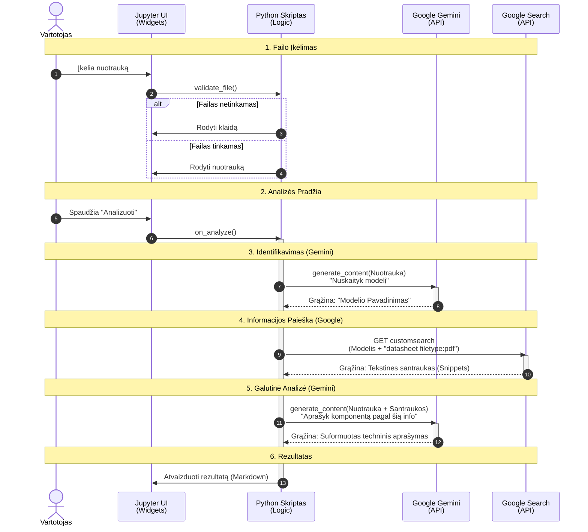

# ND

```mermaid
flowchart TD
    Start((Pradžia)) --> Input[Vartotojas įkelia failą]
    
    Input --> Check{Ar failas yra<br>paveikslėlis?}
    
    %% "Ne" atvejas
    Check -- Ne --> Error[Rodyti klaidą]
    Error --> Stop((Pabaiga))
    
    %% "Taip" atvejas
    Check -- Taip --> Show[Rodyti paveikslėlį ekrane]
    Show --> Button[Vartotojas spaudžia "Analizuoti"]

    %% 1 Žingsnis
    subgraph Step1 [1 Žingsnis: Identifikavimas]
        direction TB
        SendGemini[Siųsti nuotrauką į Gemini] --> GetName[Gauti komponento pavadinimą]
    end
    
    Button --> SendGemini

    %% 2 Žingsnis
    subgraph Step2 [2 Žingsnis: Paieška]
        direction TB
        SendGoogle[Siųsti pavadinimą į Google Search API] --> GetSnippets[Gauti teksto santraukas / Snippets]
    end

    GetName --> SendGoogle

    %% 3 Žingsnis
    subgraph Step3 [3 Žingsnis: Generavimas]
        direction TB
        SendFinal[Siųsti Nuotrauką + Santraukas į Gemini] --> GenDesc[Sugeneruoti galutinį aprašymą]
    end

    GetSnippets --> SendFinal

    %% Pabaiga
    GenDesc --> Result[Išvesti rezultatą į ekraną]
    Result --> Stop
```
Išanalizuok pateiktą elektroninio komponento nuotrauką ir pateikite šią informaciją:
1.  Tipas: (pvz., rezistorius, kondensatorius, operacinis stiprintuvas, instumencinis stiprintuvas)
2.  Modelis: (pvz., INA826AIDR)
3.  Aprašimas: (pvz., trumpas aprašymas, galima paskirtis, veikimo principas)
4.  Parametrai: (pvz., varža, talpa, korpuso tipas, svarbiausi parametrai šio tipo komponentams)
Rašant parametrus rašik taip: pvz., V_OSI (Input stage offset voltage):  40 µV, /n V_s (Power-supply voltage): 3-36V
Atsakik tiksliai taip kaip prašoma aukščiau, be jokiu papildomu daliu.


Tipas: Daugiasluoksnis keraminis kondensatorius (MLCC)[1][2]
Modelis: Neįmanoma nustatyti. Ant komponento korpuso nėra jokių žymėjimų, kurie leistų tiksliai identifikuoti modelį. Pagal matmenų tinklelyje matomą dydį (apytiksliai 1.6 mm x 0.8 mm), tikėtina, kad tai 0603 dydžio korpuso komponentas.[3]
Aprašymas: Daugiasluoksnis keraminis kondensatorius yra pasyvusis elektronikos komponentas, skirtas kaupti elektros energiją elektriniame lauke.[4] Jo konstrukciją sudaro kintantys keramikos dielektriko ir metalinių elektrodų sluoksniai.[1][2] Dėl savo mažo dydžio, patikimumo, žemos kainos ir gerų aukšto dažnio charakteristikų šie kondensatoriai yra plačiausiai naudojami elektroniniuose prietaisuose signalų filtravimui, triukšmo slopinimui, maitinimo grandinių stabilizavimui ir kitoms funkcijoms atlikti.[1][5][6] Keraminiai kondensatoriai yra nepoliarizuoti, todėl juos galima jungti į grandinę bet kuria kryptimi.[7]
Parametrai: Kadangi tikslus modelis nežinomas, pateikiami tipiniai parametrai būdingi 0603 korpuso X7R tipo kondensatoriui:
Talpa (Capacitance): reikšmės gali svyruoti nuo kelių pikofaradų (pF) iki kelių mikrofaradų (µF)[8]
Vardinė įtampa (Rated Voltage): nurodo maksimalią saugią įtampą, kurią galima prijungti prie kondensatoriaus; tipiškai nuo 4 V iki 100 V ar daugiau[9]
Korpuso tipas (Case Size): 0603 (1.6mm x 0.8mm)[3]
Dielektriko tipas (Dielectric Material): pvz., X7R, C0G (NP0), Y5V.[10] X7R tipo kondensatoriai pasižymi didele talpa mažame tūryje, tačiau jų talpa kinta priklausomai nuo temperatūros ir įtampos.[5][11] C0G (NP0) yra stabilesni, bet mažesnės talpos.[5]
Tolerancija (Tolerance): nurodo leistiną talpos nuokrypį nuo nominalios vertės, pvz., ±5%, ±10%, ±20%[5]


///////////////////////////////////////////////////////////////////////////////////////////////////////////////////////////////////////////

Išanalizuok pateiktą elektroninio komponento nuotrauką ir pateikite šią informaciją:
1.  Tipas: (pvz., rezistorius, kondensatorius, operacinis stiprintuvas, instumencinis stiprintuvas)
2.  Modelis: (pvz., INA826AIDR)
3.  Aprašimas: (pvz., trumpas aprašymas, galima paskirtis, veikimo principas)
4.  Parametrai: (pvz., varža, talpa, korpuso tipas, svarbiausi parametrai šio tipo komponentams)
Rašant parametrus rašik taip: pvz., V_OSI (Input stage offset voltage):  40 µV, /n V_s (Power-supply voltage): 3-36V
Atsakik tiksliai taip kaip prašoma aukščiau, be jokiu papildomu daliu.


Tipas: D klasės garso stiprintuvo valdiklis (Class D [1][2]Audio Amplifier Driver).
Modelis: IRS2092S.
Aprašymas: IRS2092S yra aukštos įtampos, didelio našumo D klasės garso stiprintuvo valdiklis su integruotu PWM moduliatoriumi ir apsaugos funkcijomis. Kartu su dviem išoriniais MOSFET tranzistori[3]ais ir keliais kitais komponentais, jis leidžia sukurti pilną D klasės garso stiprintuvą. Šis integrinis grandynas pasižymi dideliu efektyvumu, au[4]kšta garso kokybe ir mažais iškraipymais. Jis plačiai naudojamas namų kino sistemose, ak[1][2]tyviose garso kolonėlėse, automobilių garso sistemose ir profesionalioje garso įrangoje.
Parametrai:
VCC (Low side supply): 10V - 18V
VB (High side floating supply): V_S + 10V iki V_S + 15V
VS (High side floating supply offset voltage): iki 100V
[1][5][6]* IO+/- (Output current): 1.0A / 1.2A
DT (Deadtime): Programuojamas (reguliuojamas)
**D[7]


///////////////////////////////////////////////////////////////////////////////////////////////////////////////////////////////////////////


Išanalizuok pateiktą elektroninio komponento nuotrauką ir pateikite šią informaciją:
1.  Tipas: (pvz., rezistorius, kondensatorius, operacinis stiprintuvas, instumencinis stiprintuvas)
2.  Modelis: (pvz., INA826AIDR)
3.  Aprašimas: (pvz., trumpas aprašymas, galima paskirtis, veikimo principas)
4.  Parametrai: (pvz., varža, talpa, korpuso tipas, svarbiausi parametrai šio tipo komponentams)
Rašant parametrus rašik taip: pvz., V_OSI (Input stage offset voltage):  40 µV, /n V_s (Power-supply voltage): 3-36V
Atsakik tiksliai taip kaip prašoma aukščiau, be jokiu papildomu daliu.


Tipas: Integruotas D klasės garso stiprintuvas.
Mo[1][2]delis: MA5332MS.
Aprašymas: MA5332MS yra kelių lustų modulis (MCM), kuriame integruotas dviejų kanalų PWM valdiklis, aukštos įtampos geito valdiklis ir keturi žemos varžos MOSFET tranzistoriai. Tai yra didelio našumo, analoginio įėjimo [3]D klasės garso stiprintuvas, galintis veikti be aušinimo radiatoriaus. Dėl mažo, 7x7 mm dydžio korpuso ir didelio efektyvumo (iki 95%), jis puikiai[4] tinka garso sistemoms, kuriose reikalinga didelė galia ir kompaktiškumas, pavyzdžiui, nam[1][2]ų kino sistemoms, aktyvioms kolonėlėms ar garso sistemoms automobiliuose. Komponentas turi integruotas apsaugos funkcijas nuo per didelės srovės, perkaitimo ir per žemos įtampos.
Parametrai:
Išėjimo galia (Output Power): 2 x 200W (prie 4Ω apkrovos).
[1][5][6]Kanalų skaičius (Speaker Channels): 2.
Maitinimo įtampa (Supply Voltage): +/-25V arba 50V.
*[7] Efektyvumas (Efficiency): iki 95%.
Garso įėjimo tipas (Audio Input Type): Analoginis.
Korpuso tipas (Package): PG-IQFN-42 (7mm x 7mm).
Konfigūracijos (Configuration options): Gali būti konfigūruojamas kaip 2 [8]rašymas:** MA5332MS yra kelių lustų modulis (MCM), kuriame integruotas dviejų kanalų PWM valdiklis, aukštos įtampos geito valdiklis ir keturi žemos varžos MOSFET tranzistoriai. Tai yra didelio našumo, analoginio įėjimo D klasės garso stiprintuvas, galintis veikti be aušinimo radiatoriaus. Dėl mažo, 7x7 mm dydžio korpuso ir didelio efektyvumo (iki 95%), jis puikiai tinka garso sistemoms, kuriose reikalinga didelė galia ir kompaktiškumas, pavyzdžiui, namų kino sistemoms, aktyvioms kolonėlėms ar garso sistemoms automobiliuose. Komponentas turi integruotas apsaugos funkcijas nuo per didelės srovės, perkaitimo ir per žemos įtampos.


